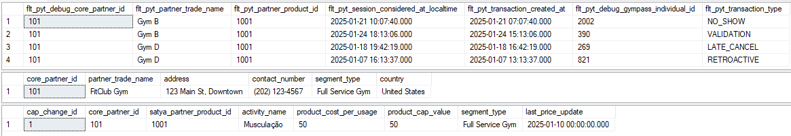
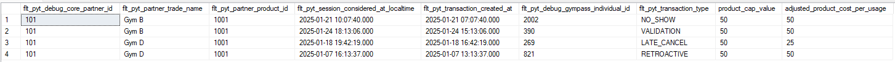
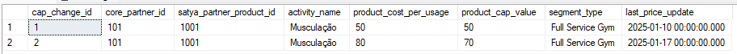
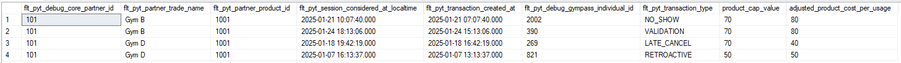
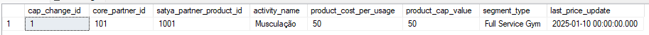
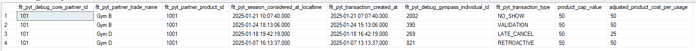

# Mid-Month Price Change Automation

## Introduction

This project aims to automate the process of updating prices and CAPs for multiple partners, ensuring that payments are always recalculated based on the new rules. The system must efficiently handle large volumes of data, applying changes in a way that reduces errors and manual effort.

To execute this project, I will utilize part of the datasets and queries developed in [Phase 1](https://github.com/eliabearaujo/partner-payments-bi/blob/c100f8f8e7029e19a9760c9f156fced5871b126c/README.md), including the data structure and organization. We will use the datasets that have already been prepared, validated, and cleaned through a **Python script**, which can be viewed [here](https://github.com/eliabearaujo/partner-payments-bi/blob/c100f8f8e7029e19a9760c9f156fced5871b126c/Partner_Performance_Insights_Business_Case.ipynb). These datasets will serve as the information source; we will not import them into SSMS but will use the already structured data to validate our automation process.

We will also use **SQL Server Management Studio (SSMS)** to create tables, register information, and process price and CAP change requests. After building all the necessary datasets, we will extract a unified dataset via **CSV** and use it to build a dashboard in **Looker Studio**.

## Understanding the Case

Before starting any analysis, it is essential to clearly define the problem to be solved. The purpose of this phase is to establish the analysis objectives and define key assumptions that will guide the project.

### Objective

The data presented represents visits and payments made to partners. Within this context, I am responsible for developing an automation aimed at accurately calculating the CAP and the payments that should be made to partners, even when there are requests for value and CAP changes mid-month.

- Create an automation that enables the precise calculation of payments and reduces manual effort, thereby improving engagement and operational efficiency.
- Track and maintain a history of change requests.
- Presenting the findings through comprehensive documentation, structured queries, insightful dashboards, and an executive presentation.

There are no restrictions on the tools used; however, it is mandatory that the documentation, queries, dashboard, and presentation be delivered in English.

### Assumptions

During the initial data assessment, the following assumptions were made to ensure consistent calculations and interpretations:

- Although the product table indicates a CAP and cost per product, the data structure will be designed so that partners with the same product can have different CAPs and costs. This allows us to make changes specific to a particular partner and product.

- Estamos considerando tambem que as solicitacoes

- CAP Adjustment → Upon reviewing the provided datasets, I identified that the CAP value is approximately 10 times the session cost. Based on the case description, which defines the CAP (Maximum Payment Limit) as the maximum amount that can be paid per visit, and considering the provided example where the session cost is close to the CAP value, we adjusted this metric by dividing the reported CAP by 10.

- Classification of Payment Type → The "Retroactive" payment type was classified as completed sessions, which were paid with a certain delay.

- CAP Hit Calculation → To calculate the CAP hit metric, we considered transactions where the CAP is equal to the actual session cost as having reached the payment limit.

## Understanding the Data

After conducting an initial analysis, data cleaning, and correction using **Python**, we will proceed with the creation of the database and the tables that will comprise our dataset. To achieve this, we will utilize **SQL Server Management Studio (SSMS)**, the most widely used database management system currently, as well as **MySQL** for data manipulation, insight development, correlation analysis, and data extraction.

### Initial Setup

The first step is to create a new database, which will be responsible for storing the rules, validations, and data for the tables that will be created in the future.
The step-by-step guide for building the database can be viewed [here](https://github.com/eliabearaujo/partner-payments-bi/blob/5995d325f714914589f45f10df4e0271151b3adc/Assets/SQL%20Queries/Tables%20created.sql).

With the database creation completed, we will now proceed with the creation of the tables and populate them with data.

### Automation Process

To implement the automation, the following three tables are required:

#### payment_transactions:

**Purpose**: Stores details of each transaction, including partner_id, user_id and transaction_created_at.

**Key Columns**: `flt_pyt_debug_core_partner_id`, `flt_pyt_partner_trade_name`, `flt_pyt_partner_product_id`, `flt_pyt_transaction_created_at`, `flt_pyt_transaction_type`.

| **Column**                              | **Description**                                                                                                            |
| --------------------------------------- | -------------------------------------------------------------------------------------------------------------------------- |
| flt_pyt_debug_core_partner_id           | Represents the unique identifier for the partner. This ID is used to link transactions and changes to a specific partner.  |
| flt_pyt_partner_trade_name              | Represents the name or trade name of the partner.                                                                          |
| flt_pyt_partner_product_id              | Represents the unique identifier for the product offered by the partner. This ID links transactions to a specific product. |
| flt_pyt_session_considered_at_localtime | Represents the date and time (in local time) when the session or visit was considered for payment calculations.            |
| flt_pyt_transaction_created_at          | Represents the date and time when the transaction was created or recorded in the system.                                   |
| flt_pyt_debug_gympass_individual_id     | Represents the unique identifier for the individual user (e.g., Gympass member) associated with the transaction.           |
| flt_pyt_transaction_type                | Represents the type of transaction, such as NO_SHOW, VALIDATION, LATE_CANCEL, or RETROACTIVE.                              |

#### partners:

**Purpose**: Contains information about the partners, such as their names, contact details, and locations.

**Key Columns**: `core_partner_id`, `partner_trade_name`, `address`, `contact_number`, `segment_type`, `country`.

| **Column**         | **Description**                                                                                                           |
| ------------------ | ------------------------------------------------------------------------------------------------------------------------- |
| core_partner_id    | Represents the unique identifier for the partner. This ID is used to link transactions and changes to a specific partner. |
| partner_trade_name | Represents the trade name or brand of the partner.                                                                        |
| address            | Represents the physical address of the partner.                                                                           |
| contact_number     | Represents the contact number of the partner (phone, email, etc.).                                                        |
| segment_type       | Represents the segment or category of the partner.                                                                        |
| country            | Represents the country where the partner is located.                                                                      |

#### cap_change_log:

**Purpose**: Tracks changes in CAP and cost per usage for each partner and product over time.

**Key Columns**: `product_id`, `product_cost_per_usage`, `product_cap_value`, `segment_type`.

| **Column**               | **Description**                                                                                                                                                                   |
| ------------------------ | --------------------------------------------------------------------------------------------------------------------------------------------------------------------------------- |
| cap_change_id            | Represents the unique identifier for each change record in the log. This ID is used to track individual changes to CAP or product costs.                                          |
| core_partner_id          | Represents the unique identifier for the partner. This ID links the change record to a specific partner.                                                                          |
| satya_partner_product_id | Represents the unique identifier for the product offered by the partner. This ID links the change record to a specific product.                                                   |
| activity_name            | Represents the name or description of the activity or product associated with the change.                                                                                         |
| product_cost_per_usage   | Represents the cost per usage (e.g., per visit) for the product. This value may change over time.                                                                                 |
| product_cap_value        | Represents the CAP (Maximum Payment Limit) for the product. This is the maximum amount that can be paid to the partner for a specific period, regardless of the number of visits. |
| segment_type             | Represents the segment or category of the partner.                                                                                                                                |
| last_price_update        | Represents the date and time when the CAP or product cost was last updated.                                                                                                       |

Now that we have the structure of the tables, we can create them within our database and populate them with data that will serve as a test to validate the requests for changes in cost and CAP. For this, the following MySQL query was used. It can also be viewed at [this link](https://github.com/eliabearaujo/partner-payments-bi/blob/5995d325f714914589f45f10df4e0271151b3adc/Assets/SQL%20Queries/Tables%20created.sql).

```sql
  CREATE TABLE payment_transactions (
    flt_pyt_debug_core_partner_id INT,
    flt_pyt_partner_trade_name VARCHAR(255),
    flt_pyt_partner_product_id INT,
    flt_pyt_session_considered_at_localtime DATETIME,
    flt_pyt_transaction_created_at DATETIME,
    flt_pyt_debug_gympass_individual_id INT,
    flt_pyt_transaction_type VARCHAR(50)
);

CREATE TABLE partners (
    core_partner_id INT PRIMARY KEY,
    partner_trade_name VARCHAR(255),
    address VARCHAR(255),
    contact_number VARCHAR(50),
    segment_type VARCHAR(100),
    country VARCHAR(100)
);

CREATE TABLE cap_change_log (
	cap_change_id INT,
    core_partner_id INT,
    satya_partner_product_id INT,
    activity_name VARCHAR(100),
    product_cost_per_usage FLOAT,
    product_cap_value FLOAT,
    segment_type VARCHAR(100),
    last_price_update DATETIME
);
```

With the execution of the query above, we now have three tables with defined data formats and primary keys, but they still need to be populated. To achieve this, unlike what we did in the first phase, we will not populate the table using CSV files but rather by performing CRUD operations (Create, Read, Update, Delete) on each table. We will proceed this way to simulate a more realistic scenario, as in the day-to-day operations, the data is expected to already be structured within a table or database, rather than being imported from external files.

We will populate the tables with only one partner, a minimal volume of visits, and just one request for value changes. From there, we will proceed with additional requests using CRUD operations and observe the behavior of the CAP and cost.

The following queries were used to populate the tables with test data:

```sql
INSERT INTO payment_transactions (
    flt_pyt_debug_core_partner_id,
    flt_pyt_partner_trade_name,
    flt_pyt_partner_product_id,
    flt_pyt_session_considered_at_localtime,
    flt_pyt_transaction_created_at,
    flt_pyt_debug_gympass_individual_id,
    flt_pyt_transaction_type
) VALUES
(101, 'Gym B', 1001, CONVERT(DATETIME, '2025-01-21 10:07:40', 120), CONVERT(DATETIME, '2025-01-21 07:07:40', 120), 2002, 'NO_SHOW'),
(101, 'Gym B', 1001, CONVERT(DATETIME, '2025-01-24 18:13:06', 120), CONVERT(DATETIME, '2025-01-24 15:13:06', 120), 390, 'VALIDATION'),
(101, 'Gym D', 1001, CONVERT(DATETIME, '2025-01-18 19:42:19', 120), CONVERT(DATETIME, '2025-01-18 16:42:19', 120), 269, 'LATE_CANCEL'),
(101, 'Gym D', 1001, CONVERT(DATETIME, '2025-01-07 16:13:37', 120), CONVERT(DATETIME, '2025-01-07 13:13:37', 120), 821, 'RETROACTIVE');


INSERT INTO partners (
    core_partner_id,
    partner_trade_name,
    address,
    contact_number,
    segment_type,
    country
) VALUES
(101, 'FitClub Gym', '123 Main St, Downtown', '(202) 123-4567', 'Full Service Gym', 'United States');


INSERT INTO cap_change_log (
	cap_change_id,
    core_partner_id,
    satya_partner_product_id,
    activity_name,
    product_cost_per_usage,
    product_cap_value,
    segment_type,
    last_price_update
) VALUES
(1,101, 1001, 'Musculação', 50, 50, 'Full Service Gym', CONVERT(DATETIME, '2025-01-10 00:00:00', 120));
```

We can verify that the CRUD operations were successful using the following command:

```sql
SELECT * FROM payment_transactions
SELECT * FROM partners
SELECT * FROM cap_change_log
```



With all the steps of table creation completed, we can now proceed with our tests, register new requests, and observe the impact of these requests on the cost and CAP.

## Tests

To begin the tests, let's first check our visits table and the cost and CAP of each visit before making any change requests. This will give us a reference point for where we started and where we are heading. We will use the following query to inspect the rows in the visits table:

```sql
-- Query retrieving the CAP and cost before the adjustment request.

SELECT
    pt.*,
    ccl.product_cap_value,
    CASE
        WHEN pt.flt_pyt_transaction_type = 'LATE_CANCEL'
        THEN ccl.product_cost_per_usage / 2
        ELSE ccl.product_cost_per_usage
    END AS adjusted_product_cost_per_usage
FROM payment_transactions pt
LEFT JOIN cap_change_log ccl
    ON pt.flt_pyt_debug_core_partner_id = ccl.core_partner_id
    AND pt.flt_pyt_partner_product_id = ccl.satya_partner_product_id;
```



So, as we can see, all CAPs returned a value of 50, and the same applies to the costs, except for the row where the payment_type is equal to LATE_CANCEL, as in these cases, the amount to be paid is 50% of the cost value.

With this confirmed, we are ready to proceed. Looking at our table above, we can see that we have visits to the same partner and the same product on four different dates: 07/01/2025, 18/01/2025, 21/01/2025, and 24/01/2025. We will now make our first request to change the value and CAP. We will insert a change request on 17/01/2025. It is expected that this change will only impact sessions with a date equal to or later than 17/01/2025, and for dates prior to that, the value will remain the same as before.

To make the first request, the following query was used:

```sql
-- Inserting the first change request for the partner.

INSERT INTO cap_change_log (
	cap_change_id,
    core_partner_id,
    satya_partner_product_id,
    activity_name,
    product_cost_per_usage,
    product_cap_value,
    segment_type,
    last_price_update
) VALUES
(2,101, 1001, 'Musculação', 80, 70, 'Full Service Gym', CONVERT(DATETIME, '2025-01-17 00:00:00', 120));
```

We can also verify if the insertion of the change was successful using the following query:

```sql
--- Checking if a change request was inserted.
SELECT * FROM cap_change_log
```



It worked exactly as it should. Now, we need to verify if this change is reflected in the visits table. To do this, we will rewrite the query to ensure that the CAP and cost values returned are correct for the rows where the session date is equal to or later than the change request date.

The query below aims to retrieve all transactions from the payment_transactions table, associating the correct values of product_cap_value and product_cost_per_usage from the cap_change_log table. It ensures that, for each transaction, the product value is based on the change history, considering the last valid price before the transaction date. If there are no previous records, it uses the first price recorded.

```sql
-- Checking if the new price is being applied.
SELECT
    pt.flt_pyt_debug_core_partner_id,
    pt.flt_pyt_partner_trade_name,
    pt.flt_pyt_partner_product_id,
    pt.flt_pyt_session_considered_at_localtime,
    pt.flt_pyt_transaction_created_at,
    pt.flt_pyt_debug_gympass_individual_id,
    pt.flt_pyt_transaction_type,
    COALESCE(ccl.product_cap_value, first_ccl.product_cap_value) AS product_cap_value,
    COALESCE(
        CASE
            WHEN pt.flt_pyt_transaction_type = 'LATE_CANCEL'
            THEN ccl.product_cost_per_usage / 2
            ELSE ccl.product_cost_per_usage
        END,
        CASE
            WHEN pt.flt_pyt_transaction_type = 'LATE_CANCEL'
            THEN first_ccl.product_cost_per_usage / 2
            ELSE first_ccl.product_cost_per_usage
        END
    ) AS adjusted_product_cost_per_usage
FROM payment_transactions pt

-- Retrieves the most recent price before the transaction date.
OUTER APPLY (
    SELECT TOP 1
        ccl1.product_cost_per_usage,
        ccl1.product_cap_value
    FROM cap_change_log ccl1
    WHERE ccl1.core_partner_id = pt.flt_pyt_debug_core_partner_id
    AND ccl1.satya_partner_product_id = pt.flt_pyt_partner_product_id
    AND ccl1.last_price_update <= pt.flt_pyt_transaction_created_at
    ORDER BY ccl1.last_price_update DESC
) ccl

-- If there is no previous price, retrieves the first recorded price.
OUTER APPLY (
    SELECT TOP 1
        ccl2.product_cost_per_usage,
        ccl2.product_cap_value
    FROM cap_change_log ccl2
    WHERE ccl2.core_partner_id = pt.flt_pyt_debug_core_partner_id
    AND ccl2.satya_partner_product_id = pt.flt_pyt_partner_product_id
    ORDER BY ccl2.last_price_update ASC
) first_ccl;
```



It worked exactly as it should. As we can see, the session that occurred before the change request date remained unchanged, while the others had their CAP and cost updated to the new values.

Let’s make another request to verify if the update continues to work correctly. This request will have a change date of 23/01/2025, so it should only affect sessions with a date equal to or later than this date.

```sql
-- Inserting the second change request for the partner.

INSERT INTO cap_change_log (
	cap_change_id,
    core_partner_id,
    satya_partner_product_id,
    activity_name,
    product_cost_per_usage,
    product_cap_value,
    segment_type,
    last_price_update
) VALUES
(3,101, 1001, 'Musculação', 90, 75, 'Full Service Gym', CONVERT(DATETIME, '2025-01-23 00:00:00', 120));

-- Checking if a change request was inserted.
SELECT * FROM cap_change_log

-- Checking if the new price is being applied.
SELECT
    pt.flt_pyt_debug_core_partner_id,
    pt.flt_pyt_partner_trade_name,
    pt.flt_pyt_partner_product_id,
    pt.flt_pyt_session_considered_at_localtime,
    pt.flt_pyt_transaction_created_at,
    pt.flt_pyt_debug_gympass_individual_id,
    pt.flt_pyt_transaction_type,
    COALESCE(ccl.product_cap_value, first_ccl.product_cap_value) AS product_cap_value,
    COALESCE(
        CASE
            WHEN pt.flt_pyt_transaction_type = 'LATE_CANCEL'
            THEN ccl.product_cost_per_usage / 2
            ELSE ccl.product_cost_per_usage
        END,
        CASE
            WHEN pt.flt_pyt_transaction_type = 'LATE_CANCEL'
            THEN first_ccl.product_cost_per_usage / 2
            ELSE first_ccl.product_cost_per_usage
        END
    ) AS adjusted_product_cost_per_usage
FROM payment_transactions pt

OUTER APPLY (
    SELECT TOP 1
        ccl1.product_cost_per_usage,
        ccl1.product_cap_value
    FROM cap_change_log ccl1
    WHERE ccl1.core_partner_id = pt.flt_pyt_debug_core_partner_id
    AND ccl1.satya_partner_product_id = pt.flt_pyt_partner_product_id
    AND ccl1.last_price_update <= pt.flt_pyt_transaction_created_at
    ORDER BY ccl1.last_price_update DESC
) ccl

OUTER APPLY (
    SELECT TOP 1
        ccl2.product_cost_per_usage,
        ccl2.product_cap_value
    FROM cap_change_log ccl2
    WHERE ccl2.core_partner_id = pt.flt_pyt_debug_core_partner_id
    AND ccl2.satya_partner_product_id = pt.flt_pyt_partner_product_id
    ORDER BY ccl2.last_price_update ASC
) first_ccl;
```


It continues to work correctly. Now we are confident that the new cost and CAP are being considered properly when we make new requests.

However, let’s perform a few more tests. Suppose we need to roll back and delete a request. We will verify if the calculation continues to function as expected.

To delete the previous requests, we will use the following query:

```sql
-- Deleting the record to verify if the rule continues to function correctly.
DELETE FROM cap_change_log
WHERE cap_change_ID IN (2, 3);

SELECT * FROM cap_change_log
```

As can be seen, we have reverted the changes, and now the cap_change_log table is back to displaying only one value. Let’s verify if the calculation returns to what it was before.



Rodando novamente a query da base de visitas para verificar se alteracoes surtiram efeito e voltamos a ter todos os valores de cap e custo voltaram ao que eram no inicio.

```sql
SELECT
    pt.flt_pyt_debug_core_partner_id,
    pt.flt_pyt_partner_trade_name,
    pt.flt_pyt_partner_product_id,
    pt.flt_pyt_session_considered_at_localtime,
    pt.flt_pyt_transaction_created_at,
    pt.flt_pyt_debug_gympass_individual_id,
    pt.flt_pyt_transaction_type,
    COALESCE(ccl.product_cap_value, first_ccl.product_cap_value) AS product_cap_value,
    COALESCE(
        CASE
            WHEN pt.flt_pyt_transaction_type = 'LATE_CANCEL'
            THEN ccl.product_cost_per_usage / 2
            ELSE ccl.product_cost_per_usage
        END,
        CASE
            WHEN pt.flt_pyt_transaction_type = 'LATE_CANCEL'
            THEN first_ccl.product_cost_per_usage / 2
            ELSE first_ccl.product_cost_per_usage
        END
    ) AS adjusted_product_cost_per_usage
FROM payment_transactions pt

OUTER APPLY (
    SELECT TOP 1
        ccl1.product_cost_per_usage,
        ccl1.product_cap_value
    FROM cap_change_log ccl1
    WHERE ccl1.core_partner_id = pt.flt_pyt_debug_core_partner_id
    AND ccl1.satya_partner_product_id = pt.flt_pyt_partner_product_id
    AND ccl1.last_price_update <= pt.flt_pyt_transaction_created_at
    ORDER BY ccl1.last_price_update DESC
) ccl

OUTER APPLY (
    SELECT TOP 1
        ccl2.product_cost_per_usage,
        ccl2.product_cap_value
    FROM cap_change_log ccl2
    WHERE ccl2.core_partner_id = pt.flt_pyt_debug_core_partner_id
    AND ccl2.satya_partner_product_id = pt.flt_pyt_partner_product_id
    ORDER BY ccl2.last_price_update ASC
) first_ccl;
```



Once again, it worked as expected. The changes were reverted, and we are back to the state we had before inserting the change requests.

Continuing with the tests, let’s test a scenario where we receive more than one change request or need to update multiple values retroactively. For this, we will use the following CRUD operations:

```sql
INSERT INTO cap_change_log (
    cap_change_id,
    core_partner_id,
    satya_partner_product_id,
    activity_name,
    product_cost_per_usage,
    product_cap_value,
    segment_type,
    last_price_update
) VALUES
(2, 101, 1001, 'Musculação', 80, 70, 'Full Service Gym', CONVERT(DATETIME, '2025-01-23 00:00:00', 120)),
(3, 101, 1001, 'Musculação', 90, 75, 'Full Service Gym', CONVERT(DATETIME, '2025-01-19 00:00:00', 120)),
(4, 101, 1001, 'Musculação', 150, 160, 'Full Service Gym', CONVERT(DATETIME, '2025-01-24 00:00:00', 120));

SELECT * FROM cap_change_log
```

```sql
SELECT
    pt.flt_pyt_debug_core_partner_id,
    pt.flt_pyt_partner_trade_name,
    pt.flt_pyt_partner_product_id,
    pt.flt_pyt_session_considered_at_localtime,
    pt.flt_pyt_transaction_created_at,
    pt.flt_pyt_debug_gympass_individual_id,
    pt.flt_pyt_transaction_type,
    COALESCE(ccl.product_cap_value, first_ccl.product_cap_value) AS product_cap_value,
    COALESCE(
        CASE
            WHEN pt.flt_pyt_transaction_type = 'LATE_CANCEL'
            THEN ccl.product_cost_per_usage / 2
            ELSE ccl.product_cost_per_usage
        END,
        CASE
            WHEN pt.flt_pyt_transaction_type = 'LATE_CANCEL'
            THEN first_ccl.product_cost_per_usage / 2
            ELSE first_ccl.product_cost_per_usage
        END
    ) AS adjusted_product_cost_per_usage
FROM payment_transactions pt

OUTER APPLY (
    SELECT TOP 1
        ccl1.product_cost_per_usage,
        ccl1.product_cap_value
    FROM cap_change_log ccl1
    WHERE ccl1.core_partner_id = pt.flt_pyt_debug_core_partner_id
    AND ccl1.satya_partner_product_id = pt.flt_pyt_partner_product_id
    AND ccl1.last_price_update <= pt.flt_pyt_transaction_created_at
    ORDER BY ccl1.last_price_update DESC
) ccl

OUTER APPLY (
    SELECT TOP 1
        ccl2.product_cost_per_usage,
        ccl2.product_cap_value
    FROM cap_change_log ccl2
    WHERE ccl2.core_partner_id = pt.flt_pyt_debug_core_partner_id
    AND ccl2.satya_partner_product_id = pt.flt_pyt_partner_product_id
    ORDER BY ccl2.last_price_update ASC
) first_ccl;
```


As expected, the changes worked and had the intended effect. With this, we have the assurance that the changes are functioning correctly and are having the proper impact on the calculation of costs and the CAP.

Now, with the goal of finalizing the automation and building the dashboard in Looker Studio, we will recreate the tables and insert a larger volume of data. We will simulate 300 visits, 300 change requests, and approximately 20 different partners. This will demonstrate that the calculation remains functional, and all that is needed is to include the sessions through a CRUD operation or, in the case of a pre-existing database, simply run the query that performs the calculation to get the updated values.

These datasets contain a larger volume of data, so we will provide the links to the queries below:

Create the tables within the database: Link

Register the partners: Link

Simulate transactions and visits: Link

Change requests for CAP and cost: Link

Complete dataset, which feeds Google Sheets and Looker Studio: Link

Google Sheets base: Link

Looker Studio dashboard: Link
