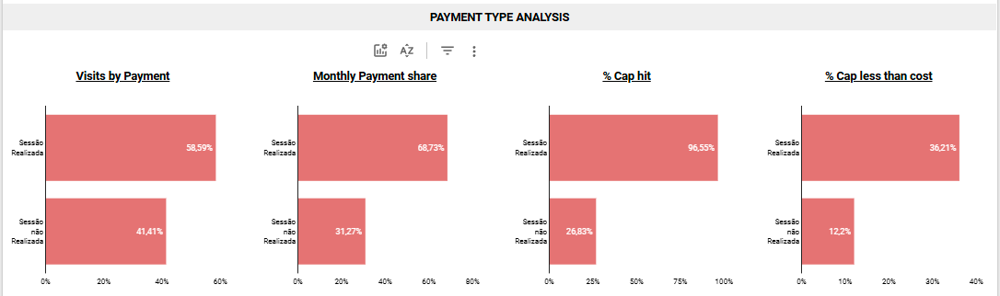

# Partner Performance Insights - Business Case

## Project background

The project aims to **analyze visit and payment data related to partners, generating business insights and automating price change processes**, with a focus on improving efficiency and decision-making within Partner Operations. The project is divided into **two main phases**, each with specific objectives:

### Phase 1: Business Intelligence Insights Generation

**Objective:**

Leverage data on visits, partners, and products to generate strategic insights that support decision-making. This includes analyzing partner performance, calculating payments while considering the CAP (Maximum Payment Limit), and identifying trends by segment.
The insights are provided in the following areas:

### Phase 2: Mid-Month Price Change Automation

**Objective:**

Automate the process of updating prices and CAPs for multiple partners, ensuring that payments are recalculated accurately based on new rules. The system must handle large volumes of data efficiently, applying changes seamlessly to reduce errors and manual effort.

Throughout this documentation, I will present the solutions to both problems, starting with Phase 1: Business Intelligence Insights Generation, and upon its completion, we will move on to Phase 2: Mid-Month Price Change Automation. Additionally, the documentation will include links to supplementary materials that provide a step-by-step guide to the analysis and its results in greater detail.

## Phase 1: Business Intelligence Insights Generation

The insights are provided in the following areas:

- **Partner Performance**
- **Segment Analysis**
- **Impact of Cancellations and No-Shows**

For the development of this project, **`Python`** was used for data preparation, correction, and cleaning, leveraging its flexibility and efficiency in handling both small and large volumes of information. After completing these steps, the data was exported in **`CSV`** format and imported into **`SQL Server Management Studio (SSMS)`**, where it was structured and manipulated to generate key correlations and insights.

Subsequently, a consolidated table was extracted in **`CSV`** format and imported into **`Google Sheets`**, enabling integration with **`Looker Studio`**. This connection facilitated the creation of interactive and dynamic visualizations, supporting data analysis based on formulated hypotheses and providing a clearer and more in-depth understanding of the results.

The **`Python` code** used to prepare, inspect, and clean the dataset is available for reference at [this link](https://github.com/eliabearaujo/partner-payments-bi/blob/dbae7314c775c6d6d9b94b5c0d8d11e118c17430/Partner_Performance_Insights_Business_Case.ipynb).

The **`SQL` queries** used for data manipulation, along with the detailed step-by-step process for creating and structuring tables in SQL Server Management Studio (SSMS), can be found at [this link](https://github.com/eliabearaujo/partner-payments-bi/blob/dbae7314c775c6d6d9b94b5c0d8d11e118c17430/SQL%20Documentation.md).

The **interactive dashboard**, designed to visualize and interact with the dataset, is accessible at [this link](https://lookerstudio.google.com/reporting/888ad2f7-08f5-4b0e-861c-3f6a3228bdcc).

The **slides containing the key insights, analyses, and detailed project information** can be accessed at [this link](https://docs.google.com/presentation/d/1e0y7xExZyQUu8JX5iuNiSbKyn2s2LN8Lj17Ci0H8LzM/edit?usp=sharing).

## Data Structure

The data was provided in **three `CSV` files**, each containing specific structured information for analysis. Below is a detailed description of each table and its respective variables:

**Tabela - Case Partner Ops Data - Table1_partners_payout**

The dataset consists of **99 rows**, with **each row representing an individual transaction**. It provides detailed information about **each visit for every partner, including the visit cost, CAP (Maximum Payment Limit), and transaction types**, offering a comprehensive view of partner activity and payment structure.

| **Field Name**                          | **Description**                                                  |
| --------------------------------------- | ---------------------------------------------------------------- |
| flt_pyt_debug_core_partner_id           | Represents the partner identification ID.                        |
| flt_pyt_partner_trade_name              | Partner trade name.                                              |
| flt_pyt_partner_product_id              | Represents the identification ID of a specific activity.         |
| flt_pyt_session_considered_at_localtime | Represents the session execution time in local time.             |
| flt_pyt_transaction_created_at          | Represents the time when the transaction was created.            |
| flt_pyt_debug_gympass_individual_id     | Represents the user's identification ID.                         |
| flt_pyt_transaction_cost                | Represents the transaction cost for the partner.                 |
| flt_pyt_transaction_type                | Represents the type of transaction being made.                   |
| flt_pyt_product_cap                     | Represents the maximum amount to be paid for that session/visit. |

**Case Partner Ops Data - Table2_dimension_store.partners**

The Partner Details dataset contains **5 rows**, with **each row representing a partner**. It includes **partner name, contact information, and location**, providing a comprehensive view of each partner's profile and segment.

| **Field Name**     | **Description**                                |
| ------------------ | ---------------------------------------------- |
| core_partner_id    | Represents the unique partner ID.              |
| partner_trade_name | Represents the partner's trade name.           |
| address            | Represents the partner's physical address.     |
| contact_number     | Represents the partner's contact phone number. |
| segment_type       | Represents the type of business segment.       |
| country            | Represents the country of the partner.         |

**Case Partner Ops Data - Table3_dimension_store.partner_products**

The Product Details dataset contains **15 rows**, with **each row representing a product**. It includes **product cost per usage, CAP, and segment type**, offering detailed insights into the product pricing and limits.

| **Field Name**           | **Description**                            |
| ------------------------ | ------------------------------------------ |
| satya_partner_product_id | Unique identifier for each product.        |
| activity_name            | Type of activity related to the product.   |
| product_cost_per_usage   | Cost charged per product usage.            |
| product_cap_value        | Maximum payment limit for the product.     |
| segment_type             | Category of the product's market segment.  |
| last_price_update        | Timestamp of the most recent price update. |

## Executive Summary

### Insights

#### Partner Performance:

- Although this is a demonstrative dataset with a limited volume of data, the average daily visits per partner stood at **0.64**. Notably, **FitClub Gym** had only about **50%** of its schedule booked, indicating that partners may be underutilized.

- **HealthFirst Wellness** accounts for **19.19%** of total visits but **23.08%** of total payments, suggesting that, despite not being the most visited partner, its transactions generate a proportionally higher revenue.

- In **67.7%** of transactions, payments reached the CAP limit, indicating that payouts are frequently constrained by the set ceiling.

- **HealthFirst Wellness** had **73.68%** of its transactions hitting the CAP, suggesting that this partner operates near its cost limit. This may increase the likelihood of requests for payment adjustments and could pose a risk to service level indicators if the partnership becomes financially unsustainable.

- Another relevant metric is **`pct_cap_less_than_cost`**, which indicates the percentage of sessions where the actual cost exceeded the CAP. **HealthFirst Wellness and StrongFit Studio** had the highest values in this metric **(~31%)**, reinforcing that these partners may be undercompensated.

- **FitClub Gym** had the lowest impact in this regard **(25%)**, likely due to a higher CAP relative to its average costs.

#### Segment Analysis:

- **Studios** account for **43.43% of visits and 43.72% of the total partner payouts**, suggesting they are a popular and accessible option for consumers. However, **Wellness Centers**, despite having only one partner in this analysis **(HealthFirst Wellness)**, hold a relatively high revenue share, indicating a **higher perceived value or a premium classification**.

- **Wellness Centers** reached the CAP in **73.68%** of transactions, indicating that the CAP for this segment may be outdated and require adjustments.

- **Studios** have the highest daily average transaction value **(R$78.39)**, directly linked to their higher visit volume compared to other segments.

- The **`pct_cap_less_than_cost`** metric reveals that Wellness Centers have the highest percentage **(31.58%)** of transactions where the CAP was lower than the actual session cost, while **Studios and Full Service Gyms** range between **24-26%**.

- - This suggests that the **CAP for Wellness Centers** may be outdated or misaligned with actual costs.

- - With **31.58%** of transactions paying below real costs, these partners might be operating with reduced margins or even losses on some transactions.

- - If this trend continues, these partners may lose interest in the platform or demand price adjustments, potentially reducing attractiveness for customers.

#### Impact of Cancellations and No-Shows:

- **Unfulfilled sessions (Late Cancel + No Show**) account for **41.41% of scheduled visits and 31.27% of total partner payouts**, showing a significant operational impact.

- **Late Cancel** alone represents nearly **1/3 of scheduled visits** and almost **20% of total partner payments**, making it a critical factor in revenue distribution.

- **50% of No Show** transactions have a CAP below actual costs, posing a financial risk, particularly for services requiring prior scheduling, such as **Nutritionists and Personal Trainers**.

- - These services represent almost **40% of the total partner payouts**, but due to cancellations, they may be operating at a loss.

- - They experience **~45% of unfulfilled sessions**, and in **~65% of cases, payments fall below actual costs**, which may threaten the sustainability of these services on the platform.

## Recomendations

#### Partner Training

- It is crucial to ensure that partners fully understand the operational processes, associated costs, and the financial impact of their decisions. If this understanding is lacking, a key initiative would be conducting training sessions. These sessions can raise awareness about their financial reality, strengthening the partnership and ensuring mutual benefits. A well-informed partner can optimize management and, as a result, enhance the end-customer experience.

#### Capacity Utilization Analysis

- Understanding each partner’s maximum capacity and their usual occupancy rate is essential for developing effective strategies. Identifying occupancy patterns can enable the creation of promotional campaigns and commercial strategies to increase utilization rates, maximize monthly revenue, and optimize space usage.

#### Benchmarking Among Partners in the Same Segment

- A detailed analysis should be conducted to understand why certain partners underperform compared to others in the same segment. From this investigation, it is possible to identify areas for improvement and implement strategic actions that strengthen the partnership, optimize results, and ensure a superior customer experience.

#### Reducing Cancellations and No-Shows

- Given that approximately 40% of transactions fail due to cancellations or no-shows, implementing strategies to mitigate this impact is essential. Some recommended actions include:

* - Sending notifications to remind users of their appointments and request attendance confirmation.
* - Waitlist system, ensuring that slots canceled in advance are automatically reassigned to interested users.
* - Incentives for frequent users, offering benefits such as priority booking for high-demand time slots to those with a strong attendance record.
* - Identifying periods with higher cancellation and no-show rates can allow for strategic adjustments in promotions and booking policies.

## Assumptions

During the initial data assessment, the following assumptions were made to ensure consistent calculations and interpretations:

- CAP Adjustment → Upon reviewing the provided datasets, I identified that the CAP value is approximately 10 times the session cost. Based on the case description, which defines the CAP (Maximum Payment Limit) as the maximum amount that can be paid per visit, and considering the provided example where the session cost is close to the CAP value, we adjusted this metric by dividing the reported CAP by 10.

- Classification of Payment Type → The "Retroactive" payment type was classified as completed sessions, which were paid with a certain delay.

- CAP Hit Calculation → To calculate the CAP hit metric, we considered transactions where the CAP is equal to the actual session cost as having reached the payment limit.

### Phase 2: Mid-Month Price Change Automation

## Project background

This project aims to automate the process of updating prices and CAPs for multiple partners, ensuring that payments are always recalculated based on the new rules. The system must efficiently handle large volumes of data, applying changes in a way that reduces errors and manual effort.

To execute this project, I will utilize part of the datasets and queries developed in phase 1, including the data structure and organization. We will use the datasets that have already been prepared, validated, and cleaned through a **Python script**, which can be viewed [here](https://github.com/eliabearaujo/partner-payments-bi/blob/dbae7314c775c6d6d9b94b5c0d8d11e118c17430/Partner_Performance_Insights_Business_Case.ipynb). These datasets will serve as the information source; we will not import them into SSMS but will use the already structured data to validate our automation process.

We will also use **SQL Server Management Studio (SSMS)** to create tables, register information, and process price and CAP change requests. After building all the necessary datasets, we will extract a unified dataset via **CSV** and use it to build a dashboard in **Looker Studio**.

As an automation project, its results are best expressed and observed in the project documentation. The links to the resolution of Phase 2 are provided below:

The **`SQL` queries** used for data manipulation, along with the detailed step-by-step process for creating and structuring tables in SQL Server Management Studio (SSMS), can be found at [this link](https://github.com/eliabearaujo/partner-payments-bi/blob/dbae7314c775c6d6d9b94b5c0d8d11e118c17430/Mid-Month%20Price%20Change%20Automation.md).

The **interactive dashboard**, designed to visualize and interact with the dataset, is accessible at [this link](https://lookerstudio.google.com/reporting/e9fc7a82-11cc-451b-948c-070f366280b8).

The **slides containing the key insights, analyses, and detailed project information** can be accessed at [this link](https://docs.google.com/presentation/d/1e0y7xExZyQUu8JX5iuNiSbKyn2s2LN8Lj17Ci0H8LzM/edit?usp=sharing).
