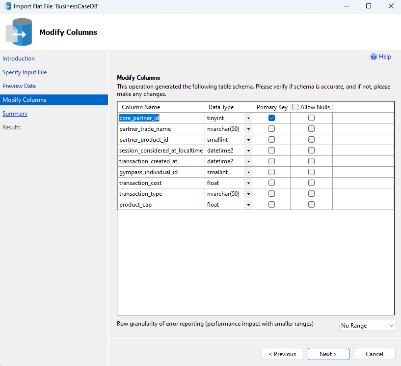

# Partner Performance Insights - Business Case

## Introduction

This project aims to analyze a dataset representing visits and payments to partners, including details on activities, segments, and payment types. To conduct the analysis, I will use **Python** for data preparation, validation, and cleaning due to its flexibility and efficiency. After this stage, the data will be exported in **CSV** format and imported into **SQL Server Management Studio (SSMS)**, where it will be structured and processed to identify key correlations and extract strategic insights.Throughout this document, I will explain the step-by-step process of creating the database, importing CSV spreadsheets, and demonstrating how the queries were structured along with their objectives. For brevity, the queries can also be accessed through [this link](https://github.com/eliabearaujo/partner-payments-bi/tree/5995d325f714914589f45f10df4e0271151b3adc/Assets/SQL%20Queries).

## Understanding the Case

Before starting any analysis, it is essential to clearly define the problem to be solved. The purpose of this phase is to establish the analysis objectives and define key assumptions that will guide the project.

### Objective

The provided data represents visits and payments made to partners. Within this context, I am responsible for developing data-driven insights for the platform that manages these partners. The key objectives include:

- Conducting an exploratory analysis of the provided data.
- Generating strategic insights to enhance partner engagement and operational efficiency.
- Presenting the findings through comprehensive documentation, structured queries, insightful dashboards, and an executive presentation.

There are no restrictions on the tools used; however, it is mandatory that the documentation, queries, dashboard, and presentation be delivered in English.

### Assumptions

During the initial data assessment, the following assumptions were made to ensure consistent calculations and interpretations:

- CAP Adjustment → Upon reviewing the provided datasets, I identified that the CAP value is approximately 10 times the session cost. Based on the case description, which defines the CAP (Maximum Payment Limit) as the maximum amount that can be paid per visit, and considering the provided example where the session cost is close to the CAP value, we adjusted this metric by dividing the reported CAP by 10.

- Classification of Payment Type → The "Retroactive" payment type was classified as completed sessions, which were paid with a certain delay.

- CAP Hit Calculation → To calculate the CAP hit metric, we considered transactions where the CAP is equal to the actual session cost as having reached the payment limit.

## Understanding the Data

After conducting an initial analysis, data cleaning, and correction using **Python**, we will proceed with the creation of the database and the tables that will comprise our dataset. To achieve this, we will utilize **SQL Server Management Studio (SSMS)**, the most widely used database management system currently, as well as **MySQL** for data manipulation, insight development, correlation analysis, and data extraction.

### Initial Setup

The first step is to create a new database, which will be responsible for storing the rules, validations, and data for the tables that will be created in the future.
To create the database, it was necessary to start a local server to simulate a storage environment and follow these steps.


With the database creation completed, we will now proceed with creating the tables that will store our data.
For this, the following MySQL query was used. It can also be viewed at [this link](https://github.com/eliabearaujo/partner-payments-bi/blob/5995d325f714914589f45f10df4e0271151b3adc/Assets/SQL%20Queries/Tables%20created.sql).

```sql
  CREATE TABLE fact_partners_payout (
    core_partner_id INT IDENTITY(1,1) PRIMARY KEY,
    partner_trade_name VARCHAR(255),
    partner_product_id INT,
    session_considered_at_localtime DATETIME,
	transaction_created_at DATETIME,
	gympass_individual_id INT,
    transaction_cost FLOAT,
    transaction_type VARCHAR(100),
    product_cap FLOAT
);

CREATE TABLE dim_store_partners (
    core_partner_id INT PRIMARY KEY,
    partner_trade_name VARCHAR(255),
    address VARCHAR(255),
    contact_number VARCHAR(50),
    segment_type VARCHAR(100),
    country VARCHAR(100)
);

CREATE TABLE dim_store_partner_products (
    product_id INT PRIMARY KEY,
	activity_name VARCHAR(255),
    product_cost_per_usage FLOAT,
    product_cap_value FLOAT,
    segment_type VARCHAR(100),
	last_price_update DATETIME
);
```


With the execution of the query above, we now have three tables with defined data formats and primary keys, but they still need to be populated. To accomplish this, we will use the corrected CSV files processed through Python. This will be done using an SSMS feature that allows the import of tabular-format files.

This step will be repeated three times to populate each table with one of the documents extracted from Python.

The import process can be completed by following the steps below."





With all the steps completed, we are now ready to proceed with creating the queries and extracting valuable insights. This stage will involve analyzing the data, identifying key patterns, and leveraging the queries to generate actionable results that will support decision-making. By applying the structure we've set up, we can ensure that the insights drawn are both meaningful and aligned with our objectives.

## Data check-up

Before proceeding further, we will create queries to verify the structure of our data. This will allow us to ensure that the data aligns with the expected results, that the number of rows matches the provided base and the figures obtained in Python, and that the data is in the correct formats to be worked with and manipulated effectively.

```sql
  SELECT TOP 10 * FROM fact_partners_payout;
  SELECT TOP 10 * FROM dim_store_partners;
  SELECT TOP 10 * FROM dim_store_partner_products;

  SELECT COUNT(*) FROM fact_partners_payout;
  SELECT COUNT(*) FROM dim_store_partners;
  SELECT COUNT(*) FROM dim_store_partner_products;

  SELECT
	  AVG(transaction_cost) as 'transaction_cost',
	  AVG(product_cap) as 'product_cap'
  FROM fact_partners_payout
```


The tables contain data in the same format, as observed. Table 1 has 99 rows, which matches the value verified in Python. The same applies to the row counts for Table 2 and Table 3. To ensure data integrity, we also checked the average values for the 'transaction_cost' and 'product_cap' columns, and both matched the values obtained after correcting the CAP and data types in Python.

## Analysis

To begin the analysis, it is essential to validate a key premise, as it directly impacts the calculation of partner payments. The premise in question is whether users can schedule more than one appointment on the same day. If this were possible, the total payments could potentially be constrained by the CAP limit.

To verify this, the following query was executed. The expected outcome of this query is an empty result set, as it would only return cases where a user had multiple sessions on the same day.

```sql
  SELECT
    gympass_individual_id,
    CAST(session_considered_at_localtime AS DATE) AS session_date,
    COUNT(*) AS session_count
FROM fact_partners_payout
GROUP BY gympass_individual_id, CAST(session_considered_at_localtime AS DATE)
HAVING COUNT(*) > 1;
```


Having confirmed that customers can schedule only one appointment per day, we will proceed with the analysis from two distinct perspectives.

The first perspective focuses on the partner and their segment. The objective is to assess the partner's performance, understand their positioning relative to other partners, evaluate their adherence to the CAP, and identify potential areas for improvement.

The second approach examines the different types of payments that each transaction can receive. We will classify the "Validation" and "Retroactive" options as confirmed and completed sessions, while "Late Cancel" and "No Show" transactions will be considered as unfulfilled sessions. This will allow us to assess the financial impact on partners and the costs incurred by us due to these types of transactions.

Several indicators have been developed to analyze performance from different perspectives. These indicators include:

| **Indicador**            | **Description**                                                                           |
| ------------------------ | ----------------------------------------------------------------------------------------- |
| jan_total_visits         | Represents the volume of visits in the month of January.                                  |
| avg_visits_per_day       | Represents the average daily volume of visits received.                                   |
| avg_revenue_per_day      | Represents the average daily revenue.                                                     |
| jan_total_payment        | Represents the total amount paid, already considering the CAP.                            |
| avg_cap                  | Represents the average CAP value.                                                         |
| cap_hit_count            | Represents the number of times the CAP was reached.                                       |
| cap_less_than_cost_count | Represents the number of times the cost exceeds the CAP.                                  |
| pct_total_visits         | Represents the percentage of visits relative to the total.                                |
| pct_total_payment        | Represents the percentage of the amount paid relative to the total.                       |
| pct_cap_hit              | Represents the percentage of times the CAP was reached relative to the total.             |
| pct_cap_less_than_cost   | Represents the percentage of times the CAP was lower than the cost relative to the total. |

### Analysis by Partner

Looking at these indicators from the partner's perspective, we have the following query:

```sql
  WITH all_days AS (
    SELECT DISTINCT CAST(fpp.session_considered_at_localtime AS DATE) AS visit_date
    FROM fact_partners_payout fpp -- This section allows us to calculate the number of days the platform "operated," rather than just counting the days the partner was active. By doing so, we can perform calculations for the entire month of January, rather than just for the days when appointments were made for that particular partner or service.
),
capped_visit_cost AS (
    SELECT
        fpp.core_partner_id,
        fpp.gympass_individual_id,
        fpp.partner_product_id,
        fpp.session_considered_at_localtime,
        fpp.transaction_cost,
        fpp.product_cap,
        CASE
            WHEN fpp.transaction_cost > fpp.product_cap THEN fpp.product_cap
            ELSE fpp.transaction_cost
        END AS capped_cost -- Pays the lower value between transaction_cost and product_cap.
    FROM fact_partners_payout fpp
),
partner_numbers AS (
    SELECT
        dsp.partner_trade_name,
        COUNT(*) AS jan_total_visits,
        SUM(fpp.transaction_cost) AS jan_total_revenue,
        SUM(cvc.capped_cost) AS jan_total_payment,
        ROUND(AVG(fpp.product_cap), 2) AS avg_cap, -- Average CAP per partner
        SUM(CASE
            WHEN fpp.transaction_cost >= fpp.product_cap THEN 1
            ELSE 0
        END) AS cap_hit_count, -- Counts the number of times the CAP was reached.
        SUM(CASE
            WHEN fpp.transaction_cost > fpp.product_cap THEN 1
            ELSE 0
        END) AS cap_less_than_cost_count -- Counts the number of times the CAP was lower than the cost.
    FROM fact_partners_payout fpp
    JOIN dim_store_partners dsp ON fpp.core_partner_id = dsp.core_partner_id
    LEFT JOIN capped_visit_cost cvc
        ON fpp.core_partner_id = cvc.core_partner_id
        AND fpp.gympass_individual_id = cvc.gympass_individual_id
        AND fpp.partner_product_id = cvc.partner_product_id
        AND fpp.session_considered_at_localtime = cvc.session_considered_at_localtime
    GROUP BY dsp.partner_trade_name
),
total_numbers AS (
    SELECT
        SUM(jan_total_visits) AS total_visits,
        SUM(jan_total_payment) AS total_payment
    FROM partner_numbers
)
SELECT
    pn.partner_trade_name,
    pn.jan_total_visits,
    ROUND(CAST(pn.jan_total_visits AS FLOAT) / (SELECT COUNT(*) FROM all_days), 2) AS avg_visits_per_day,
    ROUND(CAST(pn.jan_total_revenue AS FLOAT) / (SELECT COUNT(*) FROM all_days), 2) AS avg_revenue_per_day,
    pn.jan_total_payment,
    pn.avg_cap,
    pn.cap_hit_count,
    pn.cap_less_than_cost_count,
    ROUND(CAST(pn.jan_total_visits AS FLOAT) / tn.total_visits * 100, 2) AS pct_total_visits, -- Percentage of visits relative to the total.
    ROUND(CAST(pn.jan_total_payment AS FLOAT) / tn.total_payment * 100, 2) AS pct_total_payment, -- Percentage of the amount paid relative to the total.
    ROUND(CAST(pn.cap_hit_count AS FLOAT) / pn.jan_total_visits * 100, 2) AS pct_cap_hit, -- Percentage of times the CAP was reached.
    ROUND(CAST(pn.cap_less_than_cost_count AS FLOAT) / pn.jan_total_visits * 100, 2) AS pct_cap_less_than_cost -- Percentage of times the CAP was lower than the cost.
FROM partner_numbers pn
CROSS JOIN total_numbers tn
ORDER BY pn.jan_total_payment DESC;
```

The result of this query is:


**Key Insights and Observations:**

- **HealthFirst Wellness Performance:**

- - HealthFirst Wellness accounts for 19.19% of total visits but 23.08% of total payments. This suggests that, despite not being the partner with the highest number of visits, its transactions generate proportionally higher revenue. This could indicate that HealthFirst Wellness offers premium services or higher-priced products within its segment. However, this cannot be confirmed definitively, as it is the only partner in its segment within the dataset.

* **pct_cap_hit Analysis:**

* - The pct_cap_hit metric reveals that 50% to 73.68% of transactions reached the CAP limit. This indicates that payments are frequently constrained by the established ceiling. HealthFirst Wellness had the highest percentage (73.68%), suggesting that this partner may be operating at the edge of its margins.

* **pct_cap_less_than_cost Insights:**

- - The pct_cap_less_than_cost metric measures the percentage of sessions where the actual cost exceeded the CAP. HealthFirst Wellness and StrongFit Studio had the highest values (~31%), reinforcing the possibility that these partners may be under-remunerated. In contrast, FitClub Gym had the lowest impact in this regard (25%), likely due to its higher CAP relative to its average cost.

### Analysis by Segment

A second approach that can be adopted is to analyze partners based on their segments. This allows us to identify whether any specific segment stands out in terms of performance or impact. To conduct this analysis, we only need to modify the grouping in the previous query, resulting in the following query:

```sql
  WITH all_days AS (
    SELECT DISTINCT CAST(fpp.session_considered_at_localtime AS DATE) AS visit_date
    FROM fact_partners_payout fpp
),
capped_visit_cost AS (
    SELECT
        fpp.core_partner_id,
        fpp.gympass_individual_id,
        fpp.partner_product_id,
        fpp.session_considered_at_localtime,
        fpp.transaction_cost,
        fpp.product_cap,
        CASE
            WHEN fpp.transaction_cost > fpp.product_cap THEN fpp.product_cap
            ELSE fpp.transaction_cost
        END AS capped_cost
    FROM fact_partners_payout fpp
),
segment_numbers AS (
    SELECT
        dsp.segment_type,
        COUNT(*) AS jan_total_visits,
        SUM(fpp.transaction_cost) AS jan_total_revenue,
        SUM(cvc.capped_cost) AS jan_total_payment,
        ROUND(AVG(fpp.product_cap), 2) AS avg_cap,
        SUM(CASE
            WHEN fpp.transaction_cost >= fpp.product_cap THEN 1
            ELSE 0
        END) AS cap_hit_count,
        SUM(CASE
            WHEN fpp.transaction_cost > fpp.product_cap THEN 1
            ELSE 0
        END) AS cap_less_than_cost_count
    FROM fact_partners_payout fpp
    JOIN dim_store_partners dsp ON fpp.core_partner_id = dsp.core_partner_id
    LEFT JOIN capped_visit_cost cvc
        ON fpp.core_partner_id = cvc.core_partner_id
        AND fpp.gympass_individual_id = cvc.gympass_individual_id
        AND fpp.partner_product_id = cvc.partner_product_id
        AND fpp.session_considered_at_localtime = cvc.session_considered_at_localtime
    GROUP BY dsp.segment_type
),
total_numbers AS (
    SELECT
        SUM(jan_total_visits) AS total_visits,
        SUM(jan_total_revenue) AS total_revenue,
        SUM(jan_total_payment) AS total_payment
    FROM segment_numbers
)
SELECT
    sn.segment_type,
    sn.jan_total_visits,
    ROUND(CAST(sn.jan_total_visits AS FLOAT) / (SELECT COUNT(*) FROM all_days), 2) AS avg_visits_per_day,
    ROUND(CAST(sn.jan_total_revenue AS FLOAT) / (SELECT COUNT(*) FROM all_days), 2) AS avg_revenue_per_day,
    sn.jan_total_payment,
    sn.avg_cap,
    sn.cap_hit_count,
    sn.cap_less_than_cost_count,
    ROUND(CAST(sn.jan_total_visits AS FLOAT) / tn.total_visits * 100, 2) AS pct_total_visits,
    ROUND(CAST(sn.jan_total_revenue AS FLOAT) / tn.total_revenue * 100, 2) AS pct_total_revenue,
    ROUND(CAST(sn.jan_total_payment AS FLOAT) / tn.total_payment * 100, 2) AS pct_total_payment,
    -- Novas colunas adicionadas
    ROUND(CAST(sn.cap_hit_count AS FLOAT) / sn.jan_total_visits * 100, 2) AS pct_cap_hit, -- % de vezes que o CAP foi atingido
    ROUND(CAST(sn.cap_less_than_cost_count AS FLOAT) / sn.jan_total_visits * 100, 2) AS pct_cap_less_than_cost -- % de vezes que o CAP era menor que o custo
FROM segment_numbers sn
CROSS JOIN total_numbers tn
ORDER BY sn.jan_total_payment DESC;
```

The result of this query is:


**Key Insights and Observations:**

- **Studios Dominate Visits and Revenue:**

* - 43.43% of visits and 43.72% of revenue come from Studios. Studios appear to be the most popular choice, generating the majority of visits and revenue. However, Wellness Centers, despite having fewer visits, contribute a relatively high percentage of revenue. This suggests that the services offered by Wellness Centers may have higher added value, even though there is only one representative in this category (HealthFirst Wellness).

- **Wellness Centers Hit CAP More Frequently:**

* - Wellness Centers reach the CAP more often, indicating that their services frequently hit the payment limit. This could suggest a low CAP for this partner category, potentially leading to operational challenges. Partners in this category may become detractors in service-level indicators and are more likely to request adjustments, which could ultimately result in higher costs for end consumers.

- **Wellness Centers Face More Underpayment Issues**

* - The pct_cap_less_than_cost metric shows that 31.58% of transactions in Wellness Centers have costs exceeding the CAP. In comparison, Studios and Full-Service Gyms are more balanced (~25%). This suggests that Wellness Centers may be under-remunerated more frequently, operating with reduced margins or even incurring losses on certain transactions.

* - If this trend continues, partners in this segment may lose interest in the platform or need to adjust their pricing, which could reduce the platform's attractiveness to customers.

### Analysis by Payment type

Another valuable analysis is to understand the impact of unrealized sessions on the overall operation, including the associated costs and how they compare to sessions that were effectively completed.

To achieve this, we will examine the same metrics as before, but this time focusing on categorizing payment methods. Sessions with payment methods categorized as retroactive or validation will be grouped as "Sessões Realizadas", while those categorized as late_cancel and no_show will be grouped as "Sessões Não Realizadas". With this approach, we have the following query:

```sql
  WITH all_days AS (
    SELECT DISTINCT CAST(fpp.session_considered_at_localtime AS DATE) AS visit_date
    FROM fact_partners_payout fpp
),
capped_visit_cost AS (
    SELECT
        fpp.core_partner_id,
        fpp.gympass_individual_id,
        fpp.partner_product_id,
        fpp.session_considered_at_localtime,
        fpp.transaction_cost,
        fpp.product_cap,
        fpp.transaction_type,
        CASE
            WHEN fpp.transaction_type IN ('Retroactive', 'Validation') THEN 'Sessões Realizadas'
            WHEN fpp.transaction_type IN ('Late_Cancel', 'No_Show') THEN 'Sessões Não Realizadas'
            ELSE 'Outros'
        END AS session_group,
        CASE
            WHEN fpp.transaction_cost > fpp.product_cap THEN fpp.product_cap
            ELSE fpp.transaction_cost
        END AS capped_cost
    FROM fact_partners_payout fpp
),
session_group_numbers AS (
    SELECT
        cvc.session_group,
        COUNT(*) AS jan_total_visits,
        SUM(fpp.transaction_cost) AS jan_total_revenue,
        SUM(cvc.capped_cost) AS jan_total_payment,
        ROUND(AVG(fpp.product_cap), 2) AS avg_cap,
        SUM(CASE
            WHEN fpp.transaction_cost >= fpp.product_cap THEN 1
            ELSE 0
        END) AS cap_hit_count,
        SUM(CASE
            WHEN fpp.transaction_cost > fpp.product_cap THEN 1
            ELSE 0
        END) AS cap_less_than_cost_count
    FROM fact_partners_payout fpp
    LEFT JOIN capped_visit_cost cvc
        ON fpp.core_partner_id = cvc.core_partner_id
        AND fpp.gympass_individual_id = cvc.gympass_individual_id
        AND fpp.partner_product_id = cvc.partner_product_id
        AND fpp.session_considered_at_localtime = cvc.session_considered_at_localtime
    GROUP BY cvc.session_group
),
total_numbers AS (
    SELECT
        SUM(jan_total_visits) AS total_visits,
        SUM(jan_total_revenue) AS total_revenue,
        SUM(jan_total_payment) AS total_payment
    FROM session_group_numbers
)
SELECT
    sgn.session_group,
    sgn.jan_total_visits,
    ROUND(CAST(sgn.jan_total_visits AS FLOAT) / (SELECT COUNT(*) FROM all_days), 2) AS avg_visits_per_day,
    ROUND(CAST(sgn.jan_total_revenue AS FLOAT) / (SELECT COUNT(*) FROM all_days), 2) AS avg_revenue_per_day,
    sgn.jan_total_payment,
    sgn.avg_cap,
    sgn.cap_hit_count,
    sgn.cap_less_than_cost_count,
    ROUND(CAST(sgn.jan_total_visits AS FLOAT) / tn.total_visits * 100, 2) AS pct_total_visits,
    ROUND(CAST(sgn.jan_total_revenue AS FLOAT) / tn.total_revenue * 100, 2) AS pct_total_revenue,
    ROUND(CAST(sgn.jan_total_payment AS FLOAT) / tn.total_payment * 100, 2) AS pct_total_payment,
    ROUND(CAST(sgn.cap_hit_count AS FLOAT) / sgn.jan_total_visits * 100, 2) AS pct_cap_hit,
    ROUND(CAST(sgn.cap_less_than_cost_count AS FLOAT) / sgn.jan_total_visits * 100, 2) AS pct_cap_less_than_cost
FROM session_group_numbers sgn
CROSS JOIN total_numbers tn
ORDER BY sgn.jan_total_payment DESC;
```

The result of this query is:


**Key Insights and Observations:**

- **Overall Impact:**

* - Unrealized sessions (Late Cancel + No Show) account for 41.41% of scheduled visits and 31.27% of the amount paid to partners, demonstrating a significant operational impact.

- **Late Cancel Analysis:**

* - Late Cancel represents nearly 1/3 of scheduled visits and almost 20% of payments to partners, indicating that this cancellation category contributes significantly to revenue.

- **Late Cancel Analysis:**

* - 50% of transactions classified as No Show have a CAP lower than the actual cost, representing a financial risk, especially for services that require prior scheduling, such as Nutritionists and Personal Trainers.

* - These services account for nearly 40% of the amount paid to partners, but due to cancellations, they may be operating at a loss.

* - These activities have an ~45% unrealized session rate and ~65% of transactions result in payments below the actual cost, which could compromise the viability of these services on the platform.

## Full base

With the queries finalized, we will now write one last query to combine all the datasets into a single file. This unified dataset will serve as the foundation for building the Looker Studio dashboard. The query is as follows:

```sql
 SELECT
    fpp.*,
    dsp.partner_trade_name,
    dsp.address,
    dsp.contact_number,
    dsp.segment_type AS partner_segment,
    dsp.country,
    dspp.activity_name,
    dspp.product_cost_per_usage,
    dspp.product_cap_value,
    dspp.segment_type AS product_segment,
    dspp.last_price_update,
    CASE
        WHEN fpp.transaction_type IN ('Retroactive', 'Validation') THEN 'Sessão Realizada'
        WHEN fpp.transaction_type IN ('Late_Cancel', 'No_Show') THEN 'Sessão não Realizada'
        ELSE 'Outros'
    END AS session_group,
    CASE
        WHEN fpp.transaction_cost > fpp.product_cap THEN fpp.product_cap
        ELSE fpp.transaction_cost
    END AS capped_cost,
    CASE
        WHEN fpp.transaction_cost >= fpp.product_cap THEN 1
        ELSE 0
    END AS cap_hit_flag,
    CASE
        WHEN fpp.transaction_cost > fpp.product_cap THEN 1
        ELSE 0
    END AS cap_less_than_cost_flag
FROM fact_partners_payout fpp
LEFT JOIN dim_store_partners dsp
    ON fpp.core_partner_id = dsp.core_partner_id
LEFT JOIN dim_store_partner_products dspp
    ON fpp.partner_product_id = dspp.satya_partner_product_id
ORDER BY fpp.transaction_cost DESC;
```

The resulting dataset from this query, which will serve as the data source for the Looker dashboard, can be found at [this link](https://docs.google.com/spreadsheets/d/15zLOS7lZxhU0PF5oKwOeHG3uR-E1dPyxp5oh9SIAlTs/edit?usp=sharing).
